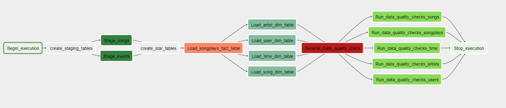
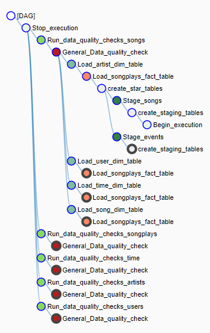

# Udacity_DataEng_P5
Udacity Nanodegree Data Engineering - Project 5 Data Pipelines

## Requirements
The following modules need to be installed:

- Apache Airflow DAG
- python3

## Overview

In this project the goal is build a complete ETL pipeline, picking up data from an s3 bucket, into staging tables in a Redshift Datawarehouse, before moving data to fact & dimension tables in a star schema. All this has to be run via Apache Airflow with proper DAGs setup, including tasks order & data quality checks.


### Architecture

The project is composed of different cloud components and a few scripts working together as described in this diagram:


#### The S3 Bucket

An AWS Bucket made publicly available, own & managed by udacity.
s3://udacity-dend/
It contains the different dataset needed for this project, that will be picked up by the etl.py scripts and copied over into the Redshift instance.
For more details on the dataset see the section "Dataset" = > https://github.com/Aleaume/Udacity_DataEng_P5#dataset 

#### The Redshift DWH

The Data warehouse used in this exercise is an AWS Redshift cluser. It is actually configured and set up via jupyter notebook (see section below).
In this example we made used of the following parameters:

Param | Value 
--- | --- 
DWH_CLUSTER_TYPE	| multi-node
DWH_NUM_NODES	| 2
DWH_NODE_TYPE	| dc2.large

#### The dag file

#### The operators

#### The SQL file

### Dataset

#### Song Data

- The song dataset is coming from the Million Song Dataset (https://labrosa.ee.columbia.edu/millionsong/). 
Each file contains metadat about 1 song and is in json format. 
Folder structure goes as follow: song_data/[A-Z]/[A-Z]/[A-Z]/name.json 

Here is an example of the file structure:

```json

{"num_songs": 1, "artist_id": "ARJIE2Y1187B994AB7", "artist_latitude": null, "artist_longitude": null, 
"artist_location": "", "artist_name": "Line Renaud", "song_id": "SOUPIRU12A6D4FA1E1", 
"title": "Der Kleine Dompfaff", "duration": 152.92036, "year": 0}

```

- The Song data S3 bucket endpoint is : s3://udacity-dend/song_data

#### Log Data

- The second dataset is generated from an event simulator (https://github.com/Interana/eventsim) based on songs in the previous dataset. Also in json it containes the logs of activity of the music streaming app.
Folder structure goes as follow : log_data/[year]/[month]/[year]-[month]-[day]-events.json
The file structure itself is similar to this:


- The Song data S3 bucket endpoint is : s3://udacity-dend/log_data and the json path: s3://udacity-dend/log_json_path.json


## DAG

```python
default_args = {
    'owner': 'udacity',
    'depends_on_past': False,
    'start_date': datetime.utcnow(),
    'retries': 3,
    'retry_delay': timedelta(minutes=5),
    'catchup': False,
    #'start_date': datetime(2019, 1, 12)
    
}

```

```python

dag = DAG('udac_example_dag',
          default_args=default_args,
          description='Load and transform data in Redshift with Airflow',
          schedule_interval='0 * * * *'
        )

```

## Tables Creation & queries

- The staging tables are simply design as complete replicas of the structure of the json files and goes as described here:


### staging_events

```SQL
CREATE TABLE IF NOT EXISTS staging_events(\
                                artist varchar,
                                auth varchar,
                                firstName varchar,
                                gender varchar,
                                itemInSession int,
                                lastName varchar,
                                length float,
                                level varchar,
                                location varchar,
                                method varchar,
                                page varchar,
                                registration float,
                                sessionId int,
                                song varchar,
                                status int,
                                ts bigint,
                                userAgent varchar,
                                userId int
    )

```

### staging_songs

```SQL

CREATE TABLE IF NOT EXISTS staging_songs(\
                                num_songs int,
                                artist_id varchar,
                                artist_latitude float,
                                artist_longitude float,
                                artist_location varchar,
                                artist_name varchar,
                                song_id varchar,
                                title varchar,
                                duration float,
                                year int

    )

```


- The sparkify DB and tables is created as showed in this diagramm, following Star Schema, were the songplays table is the fact table and the other 4 (users, songs, artists, time) are the dimension tables:


### songplays

```SQL

CREATE TABLE IF NOT EXISTS songplays(\
                        songplay_id int IDENTITY(0,1) PRIMARY KEY, \
                        start_time timestamp NOT NULL, \
                        user_id int NOT NULL,\
                        level varchar,\
                        song_id varchar,\
                        artist_id varchar,\
                        session_id int,\
                        location varchar,\
                        user_agent varchar);

```

### users

```SQL
CREATE TABLE IF NOT EXISTS users(\
                    user_id int PRIMARY KEY,\
                    first_name varchar,\
                    last_name varchar,\
                    gender varchar,\
                    level varchar);

```

### songs

```SQL
CREATE TABLE IF NOT EXISTS songs(\
                    song_id varchar PRIMARY KEY,\
                    title varchar,\
                    artist_id varchar NOT NULL,\
                    year int,\
                    duration float);

```

### artists

```SQL

CREATE TABLE IF NOT EXISTS artists(\
                        artist_id varchar PRIMARY KEY,\
                        name varchar,\
                        location varchar,\
                        latitude float,\
                        longitude float);

```

### time

```SQL
CREATE TABLE IF NOT EXISTS time (\
                    start_time timestamp PRIMARY KEY,\
                    hour int,\
                    day int,\
                    week int,\
                    month int,\
                    year int,\
                    weekday int);

```


## ETL

### Append-only OR delete-load

Thanks to a flag parmaeter bool trucate in each loading tasks, user can choose either to append-only or to delete-load.

If truncate = True, a truncate sql command is run before the sql Insert command:

```log

[2022-01-05 21:37:42,788] {load_fact.py:45} INFO - Loading the Songplays table
[2022-01-05 21:37:43,017] {logging_mixin.py:95} INFO - [2022-01-05 21:37:43,016] {base_hook.py:83} INFO - Using connection to: id: redshift. Host: redshift-cluster-1.cvmlouqtoltn.us-west-2.redshift.amazonaws.com, Port: 5439, Schema: dev, Login: awsuser, Password: XXXXXXXX, extra: {}
[2022-01-05 21:37:43,498] {logging_mixin.py:95} INFO - [2022-01-05 21:37:43,498] {dbapi_hook.py:166} INFO - truncate songplays
[2022-01-05 21:37:43,725] {logging_mixin.py:95} INFO - [2022-01-05 21:37:43,725] {base_hook.py:83} INFO - Using connection to: id: redshift. Host: redshift-cluster-1.cvmlouqtoltn.us-west-2.redshift.amazonaws.com, Port: 5439, Schema: dev, Login: awsuser, Password: XXXXXXXX, extra: {}
[2022-01-05 21:37:44,182] {logging_mixin.py:95} INFO - [2022-01-05 21:37:44,182] {dbapi_hook.py:166} INFO - 
        INSERT INTO songplays(start_time, user_id,level, song_id, artist_id, session_id, location, user_agent)
                                SELECT DISTINCT timestamp 'epoch' + CAST(e.ts AS BIGINT)/1000 * interval '1 second' ,
                                        e.userId, e.level, s.song_id, s.artist_id, e.sessionId, e.location, e.userAgent 
                                FROM staging_events e 
                                INNER JOIN staging_songs s 
                                ON e.song = s.title AND 
                                e.artist = s.artist_name AND 
                                e.length = s.duration 
                                WHERE e.page = 'NextSong' 
                                AND userID IS NOT NULL

```


## Data Quality Checks

If the checks fails, then a error is raised and task is set to failed and up for retry:

```log

Starting attempt 1 of 4
--------------------------------------------------------------------------------

[2022-01-06 20:17:58,149] {models.py:1593} INFO - Executing <Task(DataQualityOperator): Run_data_quality_checks_songplays> on 2022-01-06T20:17:06.124343+00:00
[2022-01-06 20:17:58,149] {base_task_runner.py:118} INFO - Running: ['bash', '-c', 'airflow run udac_example_dag Run_data_quality_checks_songplays 2022-01-06T20:17:06.124343+00:00 --job_id 11 --raw -sd DAGS_FOLDER/udac_example_dag.py --cfg_path /tmp/tmp86l380x6']
[2022-01-06 20:18:01,479] {base_task_runner.py:101} INFO - Job 11: Subtask Run_data_quality_checks_songplays [2022-01-06 20:18:01,469] {settings.py:174} INFO - settings.configure_orm(): Using pool settings. pool_size=5, pool_recycle=1800, pid=1216
[2022-01-06 20:18:05,749] {base_task_runner.py:101} INFO - Job 11: Subtask Run_data_quality_checks_songplays [2022-01-06 20:18:05,748] {__init__.py:51} INFO - Using executor LocalExecutor
[2022-01-06 20:18:07,555] {base_task_runner.py:101} INFO - Job 11: Subtask Run_data_quality_checks_songplays [2022-01-06 20:18:07,541] {models.py:273} INFO - Filling up the DagBag from /home/workspace/airflow/dags/udac_example_dag.py
[2022-01-06 20:18:07,823] {base_task_runner.py:101} INFO - Job 11: Subtask Run_data_quality_checks_songplays [2022-01-06 20:18:07,823] {cli.py:520} INFO - Running <TaskInstance: udac_example_dag.Run_data_quality_checks_songplays 2022-01-06T20:17:06.124343+00:00 [running]> on host de74d7988ce2
[2022-01-06 20:18:08,661] {logging_mixin.py:95} INFO - [2022-01-06 20:18:08,660] {base_hook.py:83} INFO - Using connection to: id: redshift. Host: redshift-cluster-1.cvmlouqtoltn.us-west-2.redshift.amazonaws.com, Port: 5439, Schema: dev, Login: awsuser, Password: XXXXXXXX, extra: {}
[2022-01-06 20:18:09,496] {logging_mixin.py:95} INFO - [2022-01-06 20:18:09,496] {base_hook.py:83} INFO - Using connection to: id: redshift. Host: redshift-cluster-1.cvmlouqtoltn.us-west-2.redshift.amazonaws.com, Port: 5439, Schema: dev, Login: awsuser, Password: XXXXXXXX, extra: {}
[2022-01-06 20:18:10,122] {models.py:1788} ERROR - Quality check on songplays failed
Traceback (most recent call last):
  File "/opt/conda/lib/python3.6/site-packages/airflow/models.py", line 1657, in _run_raw_task
    result = task_copy.execute(context=context)
  File "/home/workspace/airflow/plugins/operators/data_quality.py", line 46, in execute
    raise ValueError(log_fail)
ValueError: Quality check on songplays failed
[2022-01-06 20:18:10,131] {models.py:1811} INFO - Marking task as UP_FOR_RETRY

```

## Tasks Dependency
All the tasks defined have a well stated dependency in specified in the main DAG file as follow,
starting with a start_execution and finishing with an end_execution task.

```python

start_operator >> create_staging_tables

create_staging_tables >> stage_events_to_redshift
create_staging_tables >> stage_songs_to_redshift

stage_songs_to_redshift >> create_star_tables 
stage_events_to_redshift >> create_star_tables

create_star_tables >> load_songplays_table

load_songplays_table >> load_user_dimension_table
load_songplays_table >> load_song_dimension_table
load_songplays_table >> load_artist_dimension_table
load_songplays_table >> load_time_dimension_table

load_user_dimension_table >> end_operator
load_song_dimension_table >> run_quality_checks 
load_artist_dimension_table >> end_operator
load_time_dimension_table >> end_operator

run_quality_checks >> end_operator

```




## Improvement suggestions / Additional work

### Delete ALL DAG
During development & testing I made great use of an optional dag to delete all the Tables in Redshift at once:

```python

dag_Delete = DAG('delete_all',
          default_args=default_args,
          description='Delete all Tables from Redshift'
        )

delete_tables = PostgresOperator(
    task_id="delete_tables",
    dag=dag_Delete,
    postgres_conn_id="redshift",
    sql=SqlQueries.drop_all_tables
)


```
 
```sql

DROP TABLE IF EXISTS staging_events, staging_songs, songs, users, artists, time, songplays;

```
