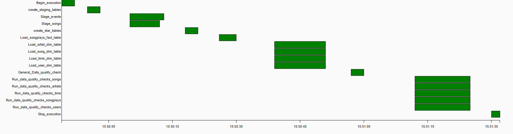
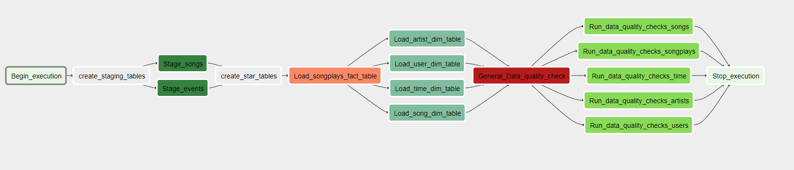
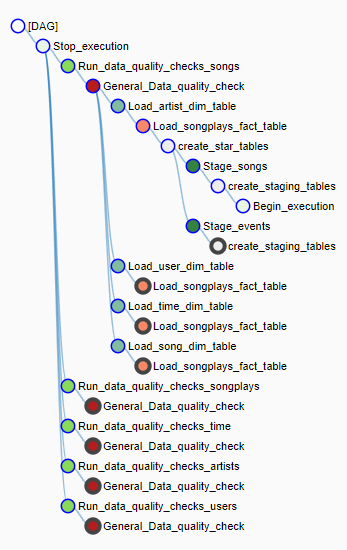

# Udacity_DataEng_P5
Udacity Nanodegree Data Engineering - Project 5 Data Pipelines

## Requirements
The following modules need to be installed:

- Apache Airflow DAG
- python3

## Overview

In this project the goal is build a complete ETL pipeline, picking up data from an s3 bucket, into staging tables in a Redshift Datawarehouse, before moving data to fact & dimension tables in a star schema. All this has to be run via Apache Airflow with proper DAGs setup, including tasks order & data quality checks.


### Architecture

The project is composed of different cloud components and a few scripts working together as described in this diagram:


#### The S3 Bucket

An AWS Bucket made publicly available, own & managed by udacity.
s3://udacity-dend/
It contains the different dataset needed for this project, that will be picked up by the etl.py scripts and copied over into the Redshift instance.
For more details on the dataset see the section "Dataset" = > https://github.com/Aleaume/Udacity_DataEng_P5#dataset 

#### The Redshift DWH

The Data warehouse used in this exercise is an AWS Redshift cluser. It is actually configured and set up via jupyter notebook (see section below).
In this example we made used of the following parameters:

Param | Value 
--- | --- 
DWH_CLUSTER_TYPE	| multi-node
DWH_NUM_NODES	| 2
DWH_NODE_TYPE	| dc2.large

#### The dag file

The DAG file, udac_dag.py contains 2 defined DAGs (Direct Acyclic Graph):
- udac_dag, responsible for the complete pipeline it is made of all the tasks discussed in this project
- dag_Delete to cleanup during development.

#### The operators

- stage_redshift.py, responsible for the copy of the json files in s3 bucket to the staging tables in Redshift
- load_fact.py, load the fact table from the staging tables
- load_dimension.py load the dimension tables from the staging tables
- data_quality.py ensure any given tables as input is not empty after having gone to its load operator.
- data_quality_spec.py ensure specific quality checks on the fact & dimension tables before ending pipeline.

#### The SQL file

Single repository of all SQL queries used along the project, sql_queries.py

### Dataset

#### Song Data

- The song dataset is coming from the Million Song Dataset (https://labrosa.ee.columbia.edu/millionsong/). 
Each file contains metadat about 1 song and is in json format. 
Folder structure goes as follow: song_data/[A-Z]/[A-Z]/[A-Z]/name.json 

Here is an example of the file structure:

```json

{"num_songs": 1, "artist_id": "ARJIE2Y1187B994AB7", "artist_latitude": null, "artist_longitude": null, 
"artist_location": "", "artist_name": "Line Renaud", "song_id": "SOUPIRU12A6D4FA1E1", 
"title": "Der Kleine Dompfaff", "duration": 152.92036, "year": 0}

```

- The Song data S3 bucket endpoint is : s3://udacity-dend/song_data

#### Log Data

- The second dataset is generated from an event simulator (https://github.com/Interana/eventsim) based on songs in the previous dataset. Also in json it containes the logs of activity of the music streaming app.
Folder structure goes as follow : log_data/[year]/[month]/[year]-[month]-[day]-events.json
The file structure itself is similar to this:


- The Song data S3 bucket endpoint is : s3://udacity-dend/log_data and the json path: s3://udacity-dend/log_json_path.json


## DAG

The DAG is made of defautl arguments as follow

```python
default_args = {
    'owner': 'udacity',
    'depends_on_past': False,
    'start_date': datetime.utcnow(),
    'retries': 3,
    'retry_delay': timedelta(minutes=5),
    'catchup': False,
    #'start_date': datetime(2019, 1, 12)
    
}

```

and is simply defined this way:

```python

dag = DAG('udac_dag',
          default_args=default_args,
          description='Load and transform data in Redshift with Airflow',
          schedule_interval='@hourly'
	  schedule_interval='0 * * * *'
        )

```

It is composed of different tasks made from Operators:
- StageToRedshiftOperator, custom 
- LoadFactOperator, custom
- LoadDimensionOperator, custom
- DataQualityOperator, custom
- DataQualityOperatorSpecific, custom
- PostgresOperator, standard for calling SQl queries on the Redshift DWH
- DummyOperator, standard for markin in the DAG begin & end steps.



## Tables Creation & queries

- The staging tables are simply design as complete replicas of the structure of the json files and goes as described here:


### staging_events

```SQL
CREATE TABLE IF NOT EXISTS staging_events(\
                                artist varchar,
                                auth varchar,
                                firstName varchar,
                                gender varchar,
                                itemInSession int,
                                lastName varchar,
                                length float,
                                level varchar,
                                location varchar,
                                method varchar,
                                page varchar,
                                registration float,
                                sessionId int,
                                song varchar,
                                status int,
                                ts bigint,
                                userAgent varchar,
                                userId int
    )

```

### staging_songs

```SQL

CREATE TABLE IF NOT EXISTS staging_songs(\
                                num_songs int,
                                artist_id varchar,
                                artist_latitude float,
                                artist_longitude float,
                                artist_location varchar,
                                artist_name varchar,
                                song_id varchar,
                                title varchar,
                                duration float,
                                year int

    )

```


- The sparkify DB and tables is created as showed in this diagramm, following Star Schema, were the songplays table is the fact table and the other 4 (users, songs, artists, time) are the dimension tables:


### songplays

Note: adapted to have a dynamic operator to load. In previous projects we used IDENTITY for the songplay_id as such:
 - songplay_id int IDENTITY(0,1) PRIMARY KEY

```SQL

CREATE TABLE IF NOT EXISTS songplays(\
                        songplay_id varchar PRIMARY KEY, \
                        start_time timestamp NOT NULL, \
                        user_id int NOT NULL,\
                        level varchar,\
                        song_id varchar,\
                        artist_id varchar,\
                        session_id int,\
                        location varchar,\
                        user_agent varchar);

```

### users

```SQL
CREATE TABLE IF NOT EXISTS users(\
                    user_id int PRIMARY KEY,\
                    first_name varchar,\
                    last_name varchar,\
                    gender varchar,\
                    level varchar);

```

### songs

```SQL
CREATE TABLE IF NOT EXISTS songs(\
                    song_id varchar PRIMARY KEY,\
                    title varchar,\
                    artist_id varchar NOT NULL,\
                    year int,\
                    duration float);

```

### artists

```SQL

CREATE TABLE IF NOT EXISTS artists(\
                        artist_id varchar PRIMARY KEY,\
                        name varchar,\
                        location varchar,\
                        latitude float,\
                        longitude float);

```

### time

```SQL
CREATE TABLE IF NOT EXISTS time (\
                    start_time timestamp PRIMARY KEY,\
                    hour int,\
                    day int,\
                    week int,\
                    month int,\
                    year int,\
                    weekday int);

```


## ETL

### COPY into Staging tables

#### staging_events

This is done via the stage_redshift Operator in a generic way as such :

```python

copy_sql = """
        COPY {}
        FROM '{}'
        ACCESS_KEY_ID '{}'
        SECRET_ACCESS_KEY '{}'
        FORMAT {}
    """

```

```SQL
("""
	copy staging_events from 's3://udacity-dend/log_data/' 
	credentials 'aws_iam_role={}'
	format json as 's3://udacity-dend/log_json_path.json'
	region 'us-west-2'
	dateformat 'auto';
""").format(ARN)

```
#### staging_songs

```SQL

("""
	copy staging_songs from 's3://udacity-dend/song_data/{}' 
	credentials 'aws_iam_role={}'
	format as json 'auto'
	region 'us-west-2';
""").format('',ARN)

```

### INSERTS into final tables

These operations are done via the load_dimension and the load_fact operators. Build in a generic way in order to use the same regardless of the tables:


```python
insert_sql = """
            INSERT INTO {}
            {}
       """
```

#### songplays

Note: this query had to be adapted compared to similar previous projects to accomodate the generic use of the operator.
for songplay_id we do not use the IDENTITY feature to generate a key but rather generate ourselves with:
- md5(events.sessionid || events.start_time) songplay_id

```SQL
INSERT INTO songplays
    SELECT
                md5(events.sessionid || events.start_time) songplay_id,
                events.start_time, 
                events.userid, 
                events.level, 
                songs.song_id, 
                songs.artist_id, 
                events.sessionid, 
                events.location, 
                events.useragent
                FROM (SELECT TIMESTAMP 'epoch' + ts/1000 * interval '1 second' AS start_time, *
            FROM staging_events
            WHERE page='NextSong') events
            LEFT JOIN staging_songs songs
            ON events.song = songs.title
                AND events.artist = songs.artist_name
                AND events.length = songs.duration;

```

#### users

```SQL
INSERT INTO users
                            SELECT DISTINCT userId, firstName, lastName, gender, level \
                            FROM staging_events \
                            WHERE page = 'NextSong'\
                            AND userID IS NOT NULL;

```

#### songs

```SQL
INSERT INTO songs
                            SELECT DISTINCT song_id, title, artist_id, year, duration \
                            FROM staging_songs;

```

#### artists

```SQL

INSERT INTO artists
                            SELECT DISTINCT artist_id, artist_name, artist_location, artist_latitude, artist_longitude \
                            FROM staging_songs;
```

#### time

```SQL
INSERT INTO time
                            SELECT DISTINCT timestamp 'epoch' + CAST(ts AS BIGINT)/1000 * interval '1 second' AS ts_ts, \
                            EXTRACT(HOUR FROM ts_ts), \
                            EXTRACT(DAY FROM ts_ts), \
                            EXTRACT(WEEK FROM ts_ts),\
                            EXTRACT(MONTH FROM ts_ts),\
                            EXTRACT(YEAR FROM ts_ts), \
                            EXTRACT(WEEKDAY FROM ts_ts)  \
                            FROM staging_events \
                            WHERE page = 'NextSong';

```

### Append-only OR delete-load

Thanks to a flag parmaeter bool trucate in each loading tasks, user can choose either to append-only or to delete-load.

If truncate = True, a truncate sql command is run before the sql Insert command:

```log

[2022-01-05 21:37:42,788] {load_fact.py:45} INFO - Loading the Songplays table
[2022-01-05 21:37:43,017] {logging_mixin.py:95} INFO - [2022-01-05 21:37:43,016] {base_hook.py:83} INFO - Using connection to: id: redshift. Host: redshift-cluster-1.cvmlouqtoltn.us-west-2.redshift.amazonaws.com, Port: 5439, Schema: dev, Login: awsuser, Password: XXXXXXXX, extra: {}
[2022-01-05 21:37:43,498] {logging_mixin.py:95} INFO - [2022-01-05 21:37:43,498] {dbapi_hook.py:166} INFO - truncate songplays
[2022-01-05 21:37:43,725] {logging_mixin.py:95} INFO - [2022-01-05 21:37:43,725] {base_hook.py:83} INFO - Using connection to: id: redshift. Host: redshift-cluster-1.cvmlouqtoltn.us-west-2.redshift.amazonaws.com, Port: 5439, Schema: dev, Login: awsuser, Password: XXXXXXXX, extra: {}
[2022-01-05 21:37:44,182] {logging_mixin.py:95} INFO - [2022-01-05 21:37:44,182] {dbapi_hook.py:166} INFO - 
        INSERT INTO songplays(start_time, user_id,level, song_id, artist_id, session_id, location, user_agent)
                                SELECT DISTINCT timestamp 'epoch' + CAST(e.ts AS BIGINT)/1000 * interval '1 second' ,
                                        e.userId, e.level, s.song_id, s.artist_id, e.sessionId, e.location, e.userAgent 
                                FROM staging_events e 
                                INNER JOIN staging_songs s 
                                ON e.song = s.title AND 
                                e.artist = s.artist_name AND 
                                e.length = s.duration 
                                WHERE e.page = 'NextSong' 
                                AND userID IS NOT NULL

```


## Data Quality Checks

### General use Data Quality Check

As requested some generic data quality check have to been implemented once all tables are loaded.

In here we simply query any desired tables and count the records to make sure there is at least 1 in each tables:

```log

*** Reading local file: /root/airflow/logs/udac_dag/General_Data_quality_check/2022-01-09T14:49:45.830697+00:00/1.log
[2022-01-09 14:50:57,047] {models.py:1359} INFO - Dependencies all met for <TaskInstance: udac_dag.General_Data_quality_check 2022-01-09T14:49:45.830697+00:00 [queued]>
[2022-01-09 14:50:57,056] {models.py:1359} INFO - Dependencies all met for <TaskInstance: udac_dag.General_Data_quality_check 2022-01-09T14:49:45.830697+00:00 [queued]>
[2022-01-09 14:50:57,056] {models.py:1571} INFO - 
--------------------------------------------------------------------------------
Starting attempt 1 of 4
--------------------------------------------------------------------------------

[2022-01-09 14:50:57,076] {models.py:1593} INFO - Executing <Task(DataQualityOperator): General_Data_quality_check> on 2022-01-09T14:49:45.830697+00:00
[2022-01-09 14:50:57,076] {base_task_runner.py:118} INFO - Running: ['bash', '-c', 'airflow run udac_dag General_Data_quality_check 2022-01-09T14:49:45.830697+00:00 --job_id 78 --raw -sd DAGS_FOLDER/udac_dag.py --cfg_path /tmp/tmpa60s34er']
[2022-01-09 14:50:57,638] {base_task_runner.py:101} INFO - Job 78: Subtask General_Data_quality_check [2022-01-09 14:50:57,637] {settings.py:174} INFO - settings.configure_orm(): Using pool settings. pool_size=5, pool_recycle=1800, pid=12463
[2022-01-09 14:50:58,492] {base_task_runner.py:101} INFO - Job 78: Subtask General_Data_quality_check [2022-01-09 14:50:58,492] {__init__.py:51} INFO - Using executor LocalExecutor
[2022-01-09 14:50:58,980] {base_task_runner.py:101} INFO - Job 78: Subtask General_Data_quality_check [2022-01-09 14:50:58,980] {models.py:273} INFO - Filling up the DagBag from /home/workspace/airflow/dags/udac_dag.py
[2022-01-09 14:50:59,020] {base_task_runner.py:101} INFO - Job 78: Subtask General_Data_quality_check [2022-01-09 14:50:59,019] {cli.py:520} INFO - Running <TaskInstance: udac_dag.General_Data_quality_check 2022-01-09T14:49:45.830697+00:00 [running]> on host 40f657b41109
[2022-01-09 14:50:59,170] {logging_mixin.py:95} INFO - [2022-01-09 14:50:59,169] {base_hook.py:83} INFO - Using connection to: id: redshift. Host: redshift-cluster-1.cvmlouqtoltn.us-west-2.redshift.amazonaws.com, Port: 5439, Schema: dev, Login: awsuser, Password: XXXXXXXX, extra: {}
[2022-01-09 14:50:59,813] {data_quality.py:34} INFO - PASSED !! users returned 104 records
[2022-01-09 14:50:59,825] {logging_mixin.py:95} INFO - [2022-01-09 14:50:59,825] {base_hook.py:83} INFO - Using connection to: id: redshift. Host: redshift-cluster-1.cvmlouqtoltn.us-west-2.redshift.amazonaws.com, Port: 5439, Schema: dev, Login: awsuser, Password: XXXXXXXX, extra: {}
[2022-01-09 14:51:00,414] {data_quality.py:34} INFO - PASSED !! songs returned 24 records
[2022-01-09 14:51:00,449] {base_task_runner.py:101} INFO - Job 78: Subtask General_Data_quality_check /opt/conda/lib/python3.6/site-packages/airflow/utils/helpers.py:356: DeprecationWarning: Importing 'PostgresOperator' directly from 'airflow.operators' has been deprecated. Please import from 'airflow.operators.[operator_module]' instead. Support for direct imports will be dropped entirely in Airflow 2.0.
[2022-01-09 14:51:00,449] {base_task_runner.py:101} INFO - Job 78: Subtask General_Data_quality_check   DeprecationWarning)
[2022-01-09 14:51:02,107] {logging_mixin.py:95} INFO - [2022-01-09 14:51:02,106] {jobs.py:2527} INFO - Task exited with return code 0

```

```python

 for table in self.tables_list:
            records_count = redshift.get_records(f"Select count(*) from {table}")[0]

            log_success = "PASSED !! {} returned {} records".format(table, records_count[0]) 
            log_fail = "FAILED !! {} returned {} records".format(table, records_count[0]) 

            if records_count[0] < 1:
                raise ValueError(log_fail)
            else:
                self.log.info(log_success)

```

### Specific Quality Check

Before ending the pipeline some data check operator has been configured.

In here we want to make sure loading of dimensions & fact tables have been run successfully.
In order to control this we compare the staging tables with the corresponding star schema tables.

```python
...
log_success = "Quality check on {} passed with {} records".format(self.table_star,records_staging) 
        log_fail = "Quality check on {} failed. {} with {} -- where staging with {}".format(self.table_star, self.table_star,records_dimfact, records_dimfact) 
        
        if records_staging == records_dimfact:
            
            self.log.info(log_success)
        else:
            raise ValueError(log_fail)

```

:warning: NOTE: this is only one type of data quality check possible for this pipeline. For instead if an error would occur at the stage to redshift phase and not copy data. This data quality check would not catch the error and simply compare 0 recor with 0 and log in a success.

If the checks fails, then a error is raised and task is set to failed and up for retry:

```log

Starting attempt 1 of 4
--------------------------------------------------------------------------------

[2022-01-06 20:17:58,149] {models.py:1593} INFO - Executing <Task(DataQualityOperator): Run_data_quality_checks_songplays> on 2022-01-06T20:17:06.124343+00:00
[2022-01-06 20:17:58,149] {base_task_runner.py:118} INFO - Running: ['bash', '-c', 'airflow run udac_example_dag Run_data_quality_checks_songplays 2022-01-06T20:17:06.124343+00:00 --job_id 11 --raw -sd DAGS_FOLDER/udac_example_dag.py --cfg_path /tmp/tmp86l380x6']
[2022-01-06 20:18:01,479] {base_task_runner.py:101} INFO - Job 11: Subtask Run_data_quality_checks_songplays [2022-01-06 20:18:01,469] {settings.py:174} INFO - settings.configure_orm(): Using pool settings. pool_size=5, pool_recycle=1800, pid=1216
[2022-01-06 20:18:05,749] {base_task_runner.py:101} INFO - Job 11: Subtask Run_data_quality_checks_songplays [2022-01-06 20:18:05,748] {__init__.py:51} INFO - Using executor LocalExecutor
[2022-01-06 20:18:07,555] {base_task_runner.py:101} INFO - Job 11: Subtask Run_data_quality_checks_songplays [2022-01-06 20:18:07,541] {models.py:273} INFO - Filling up the DagBag from /home/workspace/airflow/dags/udac_example_dag.py
[2022-01-06 20:18:07,823] {base_task_runner.py:101} INFO - Job 11: Subtask Run_data_quality_checks_songplays [2022-01-06 20:18:07,823] {cli.py:520} INFO - Running <TaskInstance: udac_example_dag.Run_data_quality_checks_songplays 2022-01-06T20:17:06.124343+00:00 [running]> on host de74d7988ce2
[2022-01-06 20:18:08,661] {logging_mixin.py:95} INFO - [2022-01-06 20:18:08,660] {base_hook.py:83} INFO - Using connection to: id: redshift. Host: redshift-cluster-1.cvmlouqtoltn.us-west-2.redshift.amazonaws.com, Port: 5439, Schema: dev, Login: awsuser, Password: XXXXXXXX, extra: {}
[2022-01-06 20:18:09,496] {logging_mixin.py:95} INFO - [2022-01-06 20:18:09,496] {base_hook.py:83} INFO - Using connection to: id: redshift. Host: redshift-cluster-1.cvmlouqtoltn.us-west-2.redshift.amazonaws.com, Port: 5439, Schema: dev, Login: awsuser, Password: XXXXXXXX, extra: {}
[2022-01-06 20:18:10,122] {models.py:1788} ERROR - Quality check on songplays failed
Traceback (most recent call last):
  File "/opt/conda/lib/python3.6/site-packages/airflow/models.py", line 1657, in _run_raw_task
    result = task_copy.execute(context=context)
  File "/home/workspace/airflow/plugins/operators/data_quality.py", line 46, in execute
    raise ValueError(log_fail)
ValueError: Quality check on songplays failed
[2022-01-06 20:18:10,131] {models.py:1811} INFO - Marking task as UP_FOR_RETRY

```

## Tasks Dependency
All the tasks defined have a well stated dependency in specified in the main DAG file as follow,
starting with a start_execution and finishing with an end_execution task.

```python

start_operator >> create_staging_tables

create_staging_tables >> [stage_events_to_redshift, stage_songs_to_redshift]

create_star_tables << [stage_events_to_redshift, stage_songs_to_redshift]

create_star_tables >> load_songplays_table

load_songplays_table >> [load_user_dimension_table, load_song_dimension_table, load_artist_dimension_table, load_time_dimension_table]

run_qualiy_checks_general << [load_user_dimension_table, load_song_dimension_table, load_artist_dimension_table, load_time_dimension_table]

run_qualiy_checks_general >> [run_quality_checks_users, run_quality_checks_songs, run_quality_checks_artists, run_quality_checks_time, run_quality_checks_songplays]

end_operator << [run_quality_checks_users, run_quality_checks_songs, run_quality_checks_artists, run_quality_checks_time, run_quality_checks_songplays]

```




## Improvement suggestions / Additional work

### Delete ALL DAG
During development & testing I made great use of an optional dag to delete all the Tables in Redshift at once:

```python

dag_Delete = DAG('delete_all',
          default_args=default_args,
          description='Delete all Tables from Redshift'
        )

delete_tables = PostgresOperator(
    task_id="delete_tables",
    dag=dag_Delete,
    postgres_conn_id="redshift",
    sql=SqlQueries.drop_all_tables
)


```
 
```sql

DROP TABLE IF EXISTS staging_events, staging_songs, songs, users, artists, time, songplays;

```

### Improvements

- First next improvement would be to add different data quality check for other stages of the pipeline.
- Also it would be useful to create a subdag for the dimesion & fact loading + data quality checks tasks. This would make the DAG easier to understand at first sight.
- Performances also could be investigated.
